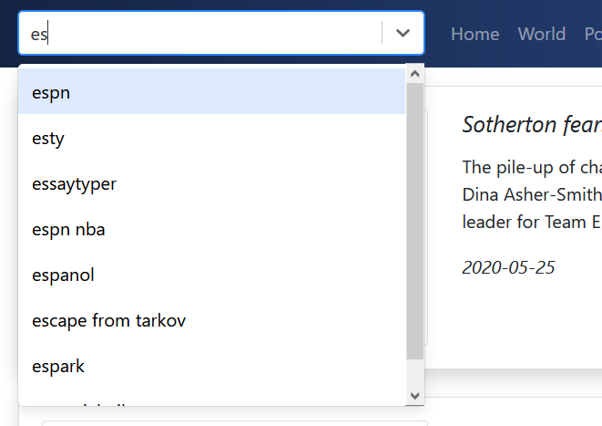
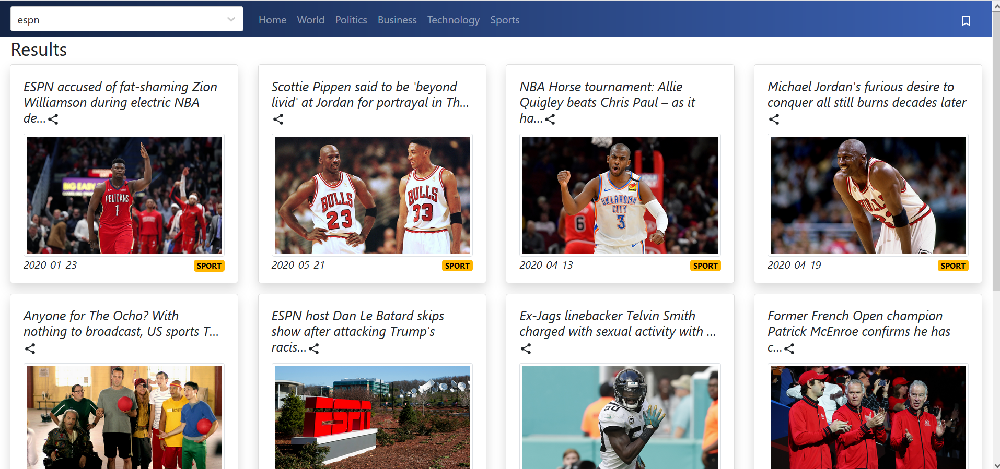
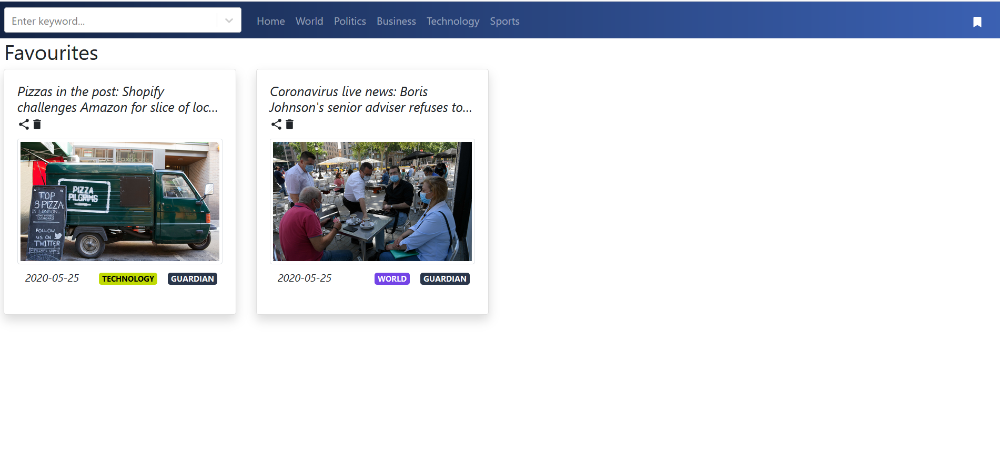
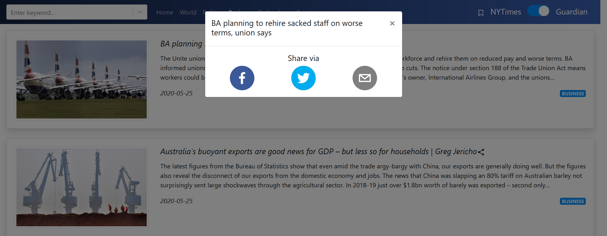

## Responsive NewsWebsite

*Created using ReactJS, React-Bootstrap and Express*

Check out the Youtube video of the website:

APIs Used:
- [New York Times](https://developer.nytimes.com/)
- [Guardian](https://open-platform.theguardian.com/)
- [Commentbox.io](https://commentbox.io/)
- [Bing Autosuggest](https://azure.microsoft.com/en-us/services/cognitive-services/autosuggest/)

## Features:

### Top Headlines

Top headlines from 6 different sections - Home, World, Business, Politics, Technology and Sports from either Guardian or NYTimes, depending on what the user selects. The user's source (NYTimes or Guardian) preference is saved in the localstorage, and articles from that source are loaded whenever the user visits the website again. 

### Detailed article and comments

Clicking on any article on any of the tabs opens up the detailed view of the article. It initially shows a truncated description of the article, and expands and scrolls up if required.

Readers can comment on articles (anonymously or under their own name, after creating a commentbox account). These comments persist and are visible to other readers who can reply/upvote the comments.

### Autosuggest and Search Articles

Typing anything in the search bar returns a list of top 10 suggestions (using the bing api). The user can select any of the suggestions which are then used to find articles from both Guardian and NYTimes with the search term

### Bookmarks

Readers can save their favourite articles by clicking on the bookmark icon. These articles are saved in the local storage and show up in the bookmarks tab.

### Share articles

Opens up a Modal with options to share via Twitter, Facebook or Email

- *Share via Facebook*
Opens up the article link along with a CSCI571 hashtag in a Facebook post which can be shared on your NewsFeed with a single click (if you're logged in)  

- *Share via Email*
Opens up the mail client installed on your desktop and with the subject and email populated with the hashtag and article link respectively

- *Share via Twitter*
Opens up Twitter in your browser with the tweet and hashtag pre-populated and ready to tweet with a single button click

